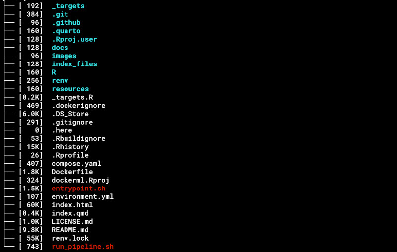

|        |
| ------: |
|  |
| A targets flowchart rendered via targets::tar_visnetwork() |

# dockerml

The goal of the `dockerml` project is to serve as a demonstration of modern reproducible research principles, applied to a classic machine learning problem using the Pima Indians Diabetes dataset from Kaggle. It aims to (1) clearly showcase each component of a reproducible workflow, (2) fully automate this workflow from code changes through published results, and (3) publish these results as a well-documented webpage using a tidymodels approach for the analysis. 

To achieve peak reproducibility, several oft-cited tools are integrated: `git` underpins version control. The R environment itself, including all package dependencies and their exact versions, is managed by `renv`. The `targets` and its related package `tarchetypes` then builds the programming pipeline. The packages, R, and the environment is wrapped into a Docker container, providing a shareable, consistent runtime environment that executes identically across different machines. For workflow automation, a GitHub Actions workflow (defined in a YAML file within the .github/workflows directory of the repository) was created. Finally, for publishing, the scientific publishing platform quarto, is used to create a webpage via pandoc. This webpage displays plots and tables and also  incorporates a  citation strategy, managed by Zotero.

# Workflow Description

The typical development and execution flow for this project follows these steps:

1.  **Local Code Edit:** Modify project code (e.g., R functions in `R/`, the `_targets.R` pipeline definition, the `index.qmd` report content, or configuration files).

2.  **Save Files:** Ensure all changes are saved locally.

3.  **Version Control (`git push`):** Commit the changes using Git and push them to the `main` (or `master`) branch on the GitHub repository (`origin`).

4.  **Trigger GitHub Actions:** The push automatically triggers the GitHub Actions workflow defined in `.github/workflows/docker-pipeline.yml`.

5.  **Action: Checkout & Build:** The workflow checks out the code and then builds the Docker image using the combined `Dockerfile` (leveraging caching from previous runs). This build step:
    * Installs system libraries (`apt-get install ...`).
    * Installs the specified Quarto CLI version.
    * Installs the `renv` R package.
    * Copies necessary project files (`renv.lock`, `.Rprofile`, `R/`, `_targets.R`, `index.qmd`, `resources/`, `entrypoint.sh`, etc.) into the image.
    * Runs `renv::restore()` to install R packages based on `renv.lock`, creating the reproducible R environment inside the image.
    
6.  **Action: Run Pipeline Script:** The workflow executes the `./run_pipeline.sh` script on the runner.

7.  **Script: Run Docker Compose:** The `run_pipeline.sh` script executes `docker compose up --build`. The `--build` flag quickly confirms the image is up-to-date (since it was just built by the Action). `docker compose up` then starts the container.

8.  **Container: Execute Entrypoint:** Docker runs the `/entrypoint.sh` script inside the container.

9.  **Entrypoint: Run Targets:** The script first calls `Rscript -e 'targets::tar_make()'`, which executes the R pipeline, building necessary data and model objects within the container's `_targets/` store.

10. **Entrypoint: Render Report:** After `tar_make` succeeds, the script calls `quarto render index.qmd --to html`, rendering the report using the objects created by `targets` (loaded via `tar_load` within `index.qmd`). The output (`index.html` and `index_files/`) is generated in the container's working directory (`/app`).

11. **Entrypoint: Move Output:** The script then moves the generated `index.html` and `index_files/` from `/app` into the `/app/_targets/user/results` directory inside the container.

12. **Docker Volume Mount:** The volume mount defined in `compose.yaml` (`- ./docs:/app/_targets/user/results`) mirrors the contents of the container's `/app/_targets/user/results` directory to the `./docs` directory on the GitHub Actions runner's filesystem.

13. **Action: Deploy to GitHub Pages:** If the previous steps succeed and the trigger was a push to `main`/`master`, the `peaceiris/actions-gh-pages` step in the workflow takes the contents of the runner's `./docs` directory and pushes them to the `gh-pages` branch of the repository.

14. **GitHub Pages Update:** GitHub automatically detects the update to the `gh-pages` branch and serves the new `index.html` and associated files at the project's GitHub Pages URL (e.g., `https://robwiederstein.github.io/dockerml/`).

# Workflow Diagram

```mermaid
flowchart TD
 subgraph subGraph0["Local Host"]
        A["Edit Code Locally"]
        B("Save Files")
        C{"Git Commit <br>&amp; Push"}
  end
 subgraph subGraph1["GitHub"]
        D{"Push Triggers <br> GitHub Action"}
  end
 subgraph subGraph2["GitHub Actions Runner"]
        E["Action: Checkout Code"]
        F["Action: Build Docker Image"]
        G["System Libs Install"]
        H["Quarto CLI Install"]
        I["renv Pkg Install"]
        J["Copy Project Files"]
        K{"Build Complete <br> Image Ready"}
        L["Action: Run Pipeline Script ./run_pipeline.sh"]
        M["Script: Run docker <br> compose up --build"]
  end
 subgraph subGraph3["Docker Compose"]
        N["Container: Start & Run /entrypoint.sh"]
        O["Entrypoint: Run targets::tar_make()"]
        P{"_targets data store"}
        Q@{ label: "Entrypoint: Run quarto render index.qmd" }
        R["/app/index.html & /app/index_files"]
        S@{ label: "Entrypoint: Move files to /app/_targets/user/results" }
  end
 subgraph subGraph4["GitHub Action Completed"]
        T@{ label: "Volume Mount Mirrors Output to `./docs` on Runner" }
        U@{ label: "Action: Deploy `./docs` to gh-pages branch" }
  end
 subgraph subGraph5["GitHub Pages"]
        V("GitHub Pages Site Updates")
        W(["View Published Report"])
  end
    A --> B
    B --> C
    C --> D
    D --> E
    E --> F
    F -- Includes --> G & H & I & J
    I --> K
    K --> L
    L --> M
    M --> N
    N --> O
    O -- Creates --> P
    O --> Q
    P -- tar_load() --> Q
    Q -- Creates --> R
    R --> S
    S --> T
    T --> U
    U --> V
    V --> W

    L@{ shape: rect}
    M@{ shape: rect}
    N@{ shape: rect}
    Q@{ shape: rect}
    S@{ shape: rect}
    T@{ shape: diamond}
    U@{ shape: rect}
     A:::Aqua
     B:::Aqua
     C:::Aqua
     D:::Aqua
     E:::Aqua
     F:::Aqua
     G:::Aqua
     H:::Aqua
     I:::Aqua
     J:::Aqua
     K:::Aqua
     L:::Aqua
     M:::Aqua
     N:::Aqua
     O:::Aqua
     P:::Aqua
     Q:::Aqua
     R:::Aqua
     S:::Aqua
     T:::Aqua
     U:::Aqua
     V:::Aqua
     W:::Aqua
    classDef Aqua stroke-width:1px, stroke-dasharray:none, stroke:#46EDC8, fill:#DEFFF8, color:#378E7A
    style A color:#000000
    style B color:#000000
    style C color:#000000
    style D color:#000000
    style E color:#000000
    style F color:#000000
    style G color:#000000
    style H color:#000000
    style I color:#000000
    style J color:#000000
    style K color:#000000
    style L color:#000000
    style M color:#000000
    style N color:#000000
    style O color:#000000
    style P color:#000000
    style Q color:#000000
    style R color:#000000
    style S color:#000000
    style T color:#000000
    style U color:#000000
    style V color:#000000
    style W color:#000000
    style subGraph1 color:none
    style subGraph2 stroke:#757575
    style subGraph5 stroke:#757575
    style subGraph4 stroke:#757575
    style subGraph3 stroke:#757575
```

# Local Host Files

Much of a project can be excluded from version control via the `.gitignore` file.  To give a reader greater context, the directory tree's first level is included below.

# Challenges

- **Long Docker Build Times:** The initial Docker build times were excessively long, taking 40-50 minutes. This was due to the large number of R packages and system dependencies being installed from scratch each time.

- **Missing System Library Dependencies in Docker:** Iteratively added system libraries (e.g., libxml2-dev, libfreetype6-dev, libfontconfig1-dev, libharfbuzz-dev, libfribidi-dev, libpng-dev, libcairo2-dev, libjpeg-dev, pkg-config) to the Dockerfile. This was necessary to allow R packages (like xml2, systemfonts) to compile and install correctly from source.

- **Platform and Architecture Mismatches (amd64 vs. arm64 on macOS host):** Eventually, combining Dockerfile.base and the main Dockerfile into a single file to simplify the build chain and resolve persistent platform resolution issues.

- **Quarto Rendering Complexities within Docker/targets:** The Quarto CLI itself failing (System command 'quarto' failed) when called by tar_quarto. The index_files directory and its contents (plots, CSS) not being generated or correctly placed when using tar_quarto with _quarto.yml's output-dir. This led to the workaround of using direct quarto render ... calls in entrypoint.sh and ensuring _quarto.yml was not present or used by the render command in the script. Ultimately, the index.qmd was removed from the targets pipeline, and the quarto render command was directly called in the entrypoint.sh script.

- **GitHub Actions Workflow Configuration:**  Refactoring the workflow to build a single combined Dockerfile instead of a separate base and pipeline image. Implementing Docker layer caching (cache-from: type=gha, cache-to: type=gha,mode=max) using docker/build-push-action. Making the run_pipeline.sh script CI-friendly (e.g., not trying to open a browser in a non-graphical environment).

# Acknowledgements

Some people and at least one company deserve special mention:

- Will Landau, author of the `targets` package.  His Github profile is [here](https://github.com/wlandau/). Eli Lilly Inc. deserves some recognition as well.

- Joel Nitta, a researcher of ferns and educator on reproducibility.  His GitHub profile can be found [here](https://github.com/joelnitta).

- `renv`

- `Rocker` project.
